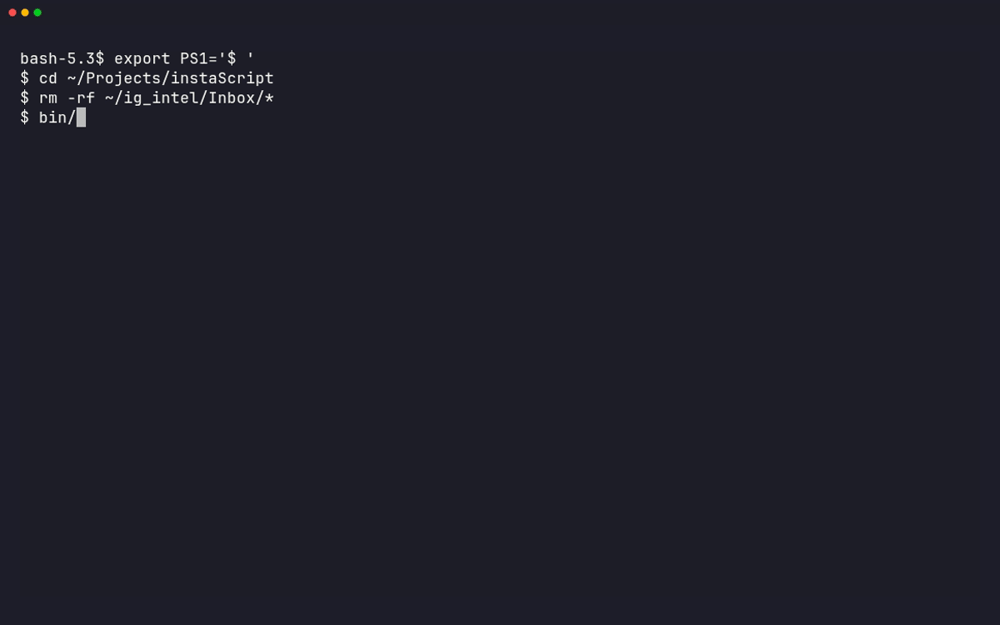

<div align="center">
  
  <h1>instaScript</h1>
  <br/>
  
</div>

**Turn any reel, video, or audio into a clean, searchable transcript — locally.**
Then optionally verify it with AI. Privacy-first, zero API cost for
transcription, works on Linux, macOS, and Windows.

```
Instagram Reel / YouTube / TikTok / podcast / meeting recording / local file
        │   yt-dlp + ffmpeg + faster-whisper   (local, CPU, no GPU, no upload)
        ▼
   Inbox/<slug>/   transcript.json (verbatim) · transcript.txt · audio.wav · source.json
        │   --review   (optional but recommended — DeepSeek)
        ▼
   summary.md + flags.md   (concise summary + advisory list of non-factual claims)
```

**Fully standalone.** The `instascript` CLI is the complete interface — paste a
link or a file, get a transcript. No agent, no Claude Code, no cloud needed for
transcription. Claude Code is an *optional* layer for organizing, connecting,
and researching the vault (see [Usage](#usage) and [Architecture](#architecture)).

---

## Why it matters — professional uses

Transcription is the boring, high-value bottleneck behind a lot of professional
work. instaScript removes it:

- **Content research** — turn competitor reels, videos, and audio into
  searchable transcripts you can cite, quote, and analyze.
- **Market & competitor intelligence** — ingest a creator's or brand's audio
  corpus locally and mine it for claims, offers, and messaging.
- **Creator workflow** — your own reels → written scripts, blog posts, and
  repurposed content, without re-watching or manual typing.
- **Meetings, lectures & podcasts** — searchable notes and archives of anything
  you can record or download.
- **Journalism & fact-checking** — verbatim transcripts + automated flagging of
  claims that look wrong, before you trust or publish them.
- **Accessibility** — text versions of audio for anyone who can't listen.
- **Study & learning** — lecture/podcast audio → searchable study material,
  linked into your own notes.
- **Archival** — a local, long-lived transcript of anything you care about,
  independent of any platform.

The pipeline is deliberately **local-first**: your audio and transcripts never
leave your machine unless you opt in to the DeepSeek verification step.

---

## Features

- **Local transcription** — faster-whisper on CPU (int8). No GPU, no API key,
  no cloud. Model downloads once (~460 MB) and runs offline.
- **Verbatim transcripts** — `transcript.json` is the canonical ground truth,
  written once and never rewritten. Whisper can mishear; the raw text is
  preserved regardless.
- **Built-in dedup** — nothing is ingested twice. Every item is stamped with
  two SHA-256 hashes: `url_sha256` (link with share-tracking params stripped)
  and `content_sha256` (of the normalized audio's PCM samples — header-stable,
  so a reel re-shared under a different URL, or re-downloaded in another
  format, is still recognized). Hashes land in `source.json` and in the
  frontmatter of `summary.md` / `flags.md`, tracing markdown → link → audio.
- **Batch queue** — drop links into a markdown checklist, run one command, and
  every item is transcribed. Verified items are removed from the queue.
- **AI verification (optional)** — DeepSeek writes a concise summary and flags
  claims that seem non-factual or overstated, each with the verbatim quote,
  concern, and confidence. Advisory: nothing is ever altered automatically.
- **Headless Claude Code integration (optional)** — every standard operation
  can route through a headless Claude Code session running on DeepSeek, which
  reads your vault instructions, drives the pipeline, and applies judgment.
- **Obsidian second brain (optional)** — a connected knowledge system built on
  the transcripts, with management classes, living index notes, and agent
  memory. See below.

---

## Installation

Requirements on every system: **Python 3.10+**, **ffmpeg**, **yt-dlp**. Install
them first, then instaScript itself (Option A/B/C below). At the end, make sure
`instascript` is on your `PATH` — or run it as `bin/instascript` from the repo.

### 1. System dependencies (ffmpeg, yt-dlp, Python)

**Linux — Debian/Ubuntu**

```sh
sudo apt install ffmpeg python3 python3-venv git
mkdir -p ~/.local/bin
curl -L https://github.com/yt-dlp/yt-dlp/releases/latest/download/yt-dlp -o ~/.local/bin/yt-dlp
chmod +x ~/.local/bin/yt-dlp
echo 'export PATH="$HOME/.local/bin:$PATH"' >> ~/.bashrc && source ~/.bashrc
```

**Linux — Fedora:** `sudo dnf install ffmpeg python3 python3-virtualenv git yt-dlp`
**Linux — Arch:** `sudo pacman -S ffmpeg python python-virtualenv git yt-dlp`

**macOS**

```sh
brew install ffmpeg python@3.12 yt-dlp git
```

**Windows**

```sh
winget install Gyan.FFmpeg yt-dlp Python.Python.3.12
# tick "Add Python to PATH" in the Python installer; use bin\instascript.cmd
# or add the repo's bin\ to your user PATH for the `instascript` command.
```

### 2a. pip install (Linux/macOS/Windows — non-NixOS)

```sh
git clone https://github.com/m-amir-gomaa/ig_intel.git
cd ig_intel
python3 -m venv .venv
.venv/bin/pip install .                     # installs the `instascript` command
ln -sf "$(pwd)/bin/instascript" ~/.local/bin/instascript   # puts it on PATH
```

`pip install .` uses the repo's `pyproject.toml`. Add
`~/.local/bin` to `PATH` if you didn't already (see Linux block above).

### 2b. Run in place (no install step)

```sh
git clone https://github.com/m-amir-gomaa/ig_intel.git
cd ig_intel
python3 -m venv .venv
.venv/bin/pip install -r requirements.txt
bin/instascript --help                       # the repo launcher: sets NixOS lib
#                                          # paths + PYTHONPATH automatically
```

### 2c. NixOS / nix (flake)

```sh
cd ig_intel
nix build .#instascript                      # → result/bin/instascript
nix profile install .#instascript           # global, on PATH
nix develop .#                              # dev shell: ffmpeg + yt-dlp + python
```

Pin it in your NixOS config:

```nix
# flake inputs
inputs.instascript.url = "github:m-amir-gomaa/ig_intel";

# systemPackages
environment.systemPackages = [
  inputs.instascript.packages.${pkgs.system}.default
];
```

> If you also use the UTCP tools on NixOS: their CLI executor hardcodes
> `/bin/bash`, which NixOS doesn't provide. Add
> `systemd.tmpfiles.rules = [ "L+ /bin/bash - - - - /run/current-system/sw/bin/bash" ]`
> and set `IG_INTEL_VAULT` + the `ANTHROPIC_*` env vars (see
> [docs/claude-code.md](docs/claude-code.md)).

### PATH — final check

```sh
which instascript        # expect your launcher / ~/.local/bin/instascript
instascript --help
```

- **Windows:** `bin\instascript.cmd` works from anywhere; or add `bin\` to
  `PATH` for a bare `instascript`.
- The repo `bin/instascript` wrapper auto-detects NixOS (sets the lib paths
  that pip wheels need) and sets `PYTHONPATH`, so it runs from any directory.

---

## Quick start

Two ways to drive the pipeline — both standalone, no Claude Code required:

| mode | command | use when |
|---|---|---|
| **Manual** | `bin/instascript <url-or-file>` | you are driving, one item at a time |
| **Automatic** | `bin/instascript --queue` | a batch of links you want processed unattended |

```sh
# Manual — one link or file, live progress in the terminal
bin/instascript "https://www.instagram.com/reel/XXXXX/"
bin/instascript ~/Downloads/lecture.mp3

# Manual + optional DeepSeek summary & factual flags (needs DEEPSEEK_API_KEY)
bin/instascript ~/Downloads/lecture.mp3 --review

# Automatic — transcribe every pending `- [ ]` line in Inbox/queue.md
bin/instascript --queue
```

Full usage: [Usage](#usage).

### What the terminal looks like (manual mode)

```
instaScript · reel/audio → local transcript
────────────────────────────────────────────────────────────────────────

[1/3] source     Video by justxashton (Ashton Forbes · 28.6s)
[2/3] audio      16 kHz mono → audio.wav
[3/3] transcribe faster-whisper small (CPU int8)

✓ saved → ~/ig_intel/Inbox/video-by-justxashton
────────────────────────────────────────
   transcript.json    verbatim segments + word timestamps
   transcript.txt     plain text
   audio.wav          16 kHz mono PCM
   source.json        metadata + dedup hashes
```

Automatic mode prints one compact line per item, then a summary:

```
instaScript · batch queue (3 items)
────────────────────────────────────────────────────────────────────────

[1/3] video-by-justxashton                        ✓
[2/3] https://example.com/not-a-video             ✗ yt-dlp failed: ...
[3/3] instascript-demo-reel                       ⏭ same audio, skipped
────────────────────────────────────────────────────────────────────────
summary: 1 done, 1 already ingested, 1 failed — queue updated
```

`--verbose` adds debug logging to stderr; the pretty output above is always on.

### Demo

The sample reel this README references, processed end-to-end:

Real run against it (`assets/demo/instascript-demo-reel.mp4` is `.gitignore`d —
`git add -f` it if you want it in the repo):

```sh
# Ingest from the share link (tracking params stripped for the URL hash)
bin/instascript "https://www.instagram.com/reel/DY-iZeGgYjj/?utm_source=ig_web_copy_link&igsh=..."
# → /home/<you>/ig_intel/Inbox/video-by-justxashton/

# Run it again — deduped before any re-download or re-transcription
bin/instascript "https://www.instagram.com/reel/DY-iZeGgYjj/?utm_source=ig_web_copy_link&igsh=..."
# → already ingested (same link) → .../video-by-justxashton

# Same audio from a local file (different container, same content) — deduped
bin/instascript assets/demo/instascript-demo-reel.mp4
# → duplicate content (already ingested) → .../video-by-justxashton
```

Full walkthrough + Upwork-ready pitch: [`docs/demo-upwork.md`](docs/demo-upwork.md).

### Output

```
<IG_INTEL_VAULT>/Inbox/<slug>/
  transcript.json    # verbatim ground truth (segments, words, timestamps)
  transcript.txt     # plain text
  audio.wav          # normalized 16 kHz mono
  source.json        # input, title, duration, url_sha256, content_sha256
  summary.md         # with --review — concise, faithful (hash frontmatter)
  flags.md           # with --review — advisory non-factual-claim list (hash frontmatter)
```

---

## AI verification — optional, but recommended

`--review` uses DeepSeek for exactly two things:

1. **summary.md** — a concise, faithful summary. No invention.
2. **flags.md** — claims that seem non-factual, unsupported, overstated, or
   wrong, each with the verbatim quote, a concern, and a confidence level.

It is advisory: the transcript is never altered, and flags are the hand-off for
you (or Claude Code) to verify against primary sources. For
medical/scientific/financial claims this matters a lot — a confident reel is
not evidence.

To run the whole workflow through Claude Code + DeepSeek, expose the optional
UTCP tools (registered via `~/.utcp/manuals/igintel.json`) — each launches a
headless Claude Code session (`claude -p`, running on DeepSeek) that reads your
vault instructions, drives the pipeline, and does the organizing, linking, and
fact-checking natively:

| tool | fires |
|---|---|
| `ig_process_queue` | batch extraction → Inbox, verified lines deleted |
| `ig_ingest` | single source → Inbox |
| `ig_review` | summary + flags on an item, then organize/verify |
| `ig_organize_inbox` | organize Inbox items into classes |
| `ig_research` | live web research on a claim/topic → provenance-tagged findings in the note |
| `ig_vault_task` | freeform: study / connect / answer from the knowledge base |

---

## Usage

Three ways to run the pipeline. **The first two need nothing but the CLI** —
Claude Code is only the optional third.

### Manual mode — you drive, one item at a time

```sh
instascript "https://www.instagram.com/reel/XXXXX/"   # URL → Inbox/<slug>/
instascript ~/Downloads/lecture.mp3                    # local audio/video file
instascript <input> --review                           # + DeepSeek summary & flags
instascript --review-item <slug-or-dir>                # review an EXISTING item
```

You are the orchestrator; the script is the worker. Progress is shown live, the
final line prints the output directory (machine-readable for scripts):

```sh
$ instascript "https://www.instagram.com/reel/DY-iZeGgYjj/"
…
✓ saved → ~/ig_intel/Inbox/video-by-justxashton
```

### Automatic mode — batch queue, unattended

`<vault>/Inbox/queue.md` is a plain markdown checklist:

```markdown
- [ ] https://www.instagram.com/reel/XXXXX/
- [ ] ~/Downloads/lecture.mp3
- [ ] https://www.youtube.com/watch?v=...
```

```sh
instascript --queue            # every pending `- [ ]` line → Inbox
```

Each successful item (including deduped ones) is **deleted** from the queue;
failed items are kept for retry. One compact line per item, summary at the end,
exit code `0` only if nothing failed — so it drops cleanly into cron/systemd.

### Guided mode — Claude Code (optional)

If you want organizing, linking, and research done *for* you, install the UTCP
tools and open a session in the vault. **Full setup + daily-driver guide:
[`docs/claude-code.md`](docs/claude-code.md).**

```sh
IG_INTEL_VAULT="$HOME/ig_intel" TAVILY_API_KEY="tvly-..." ./utcp/install.sh
cd "$IG_INTEL_VAULT" && claude     # interactive
# then: "process the queue", "review myopiasolution", "research the EGR1 claim" ...
```

| tool | fires |
|---|---|
| `ig_process_queue` | batch extraction → Inbox, verified lines deleted |
| `ig_ingest` | single source → Inbox |
| `ig_review` | summary + flags on an item, then organize/verify |
| `ig_organize_inbox` | organize Inbox items into classes |
| `ig_research` | live web research on a claim/topic → provenance-tagged findings in the note |
| `ig_vault_task` | freeform: study / connect / answer from the knowledge base |

> Guided mode drives the **same** `instascript` commands under the hood. It
> adds judgment on top; it never replaces the pipeline. Everything below works
> with or without it.

### Workflow

1. **Add links** to `Inbox/queue.md` (one `- [ ] <link>` per line), or pass a
   single link on the command line.
2. **Run**: `instascript --queue` for batches, or `instascript <input>` for
   one-off manual work.
3. **Verify**: transcripts land in `Inbox/<slug>/`; verified queue lines are
   deleted. Add `--review` for a summary + factual flags.
4. **(Optional) Research**: `instascript --review-item <slug>` for flags, or
   Claude Code (`ig_research`) to verify flagged claims against primary sources.

---

## Architecture

Single, deterministic pipeline — every mode (manual, queue, guided) runs the
same stages. Nothing is orchestrated by an agent at runtime.

```
 URL / local file
   │   yt-dlp (cookies if the platform needs login)
   ▼
 Stage A  source.py   resolve → media + source.json  (url_sha256)
   │   ffmpeg normalize → 16 kHz mono PCM
   ▼
 Stage B  audio.py    audio.wav
   │   SHA-256 of the audio → content_sha256  (dedup layer 2)
   ▼
 Stage C  transcribe.py  faster-whisper (CPU int8) → transcript.json + .txt
   │   --review (DeepSeek)
   ▼
 Stage D  summarize.py   summary.md + flags.md   (hash frontmatter)
```

| stage | module | tool | output |
|---|---|---|---|
| resolve | `source.py` | yt-dlp + ffprobe | media, `source.json` |
| normalize | `audio.py` | ffmpeg | `audio.wav` (16 kHz mono) |
| transcribe | `transcribe.py` | faster-whisper (int8, CPU) | `transcript.json`, `transcript.txt` |
| review | `summarize.py` | DeepSeek (optional) | `summary.md`, `flags.md` |
| terminal UI | `ui.py` | — | progress/status rendering |

**Dedup** is two hash layers — `url_sha256` (link, tracking params stripped)
checked *before* download, `content_sha256` (normalized audio) checked after
normalize — so nothing is ever fetched or transcribed twice.

Full design doc with UML-style diagrams, data model, and failure modes:
[`docs/architecture.md`](docs/architecture.md).

---

## Obsidian second brain — optional add-on

The core project is **transcript extraction + AI verification**. On top of that
you can turn the transcript inbox into a connected, Claude-Code-managed
knowledge system:

- Management classes (`Professional`, `Instructional`, `Interesting Later Study`)
- Living class/index notes (`Classes/Medicine.md`, ...) that link transcripts
  and concepts
- Agent memory (`.ai/`) so Claude Code operates the vault consistently
- DeepSeek flagging as the fact-checking hand-off

Point `IG_INTEL_VAULT` at an Obsidian vault folder, ingest with `instaScript`,
and open the folder in Obsidian. Full design: [docs/second-brain.md](docs/second-brain.md).

---

## Configuration

Environment variables (see `.env.example`):

| var | purpose | default |
|---|---|---|
| `IG_INTEL_VAULT` | where transcripts + knowledge live | `~/ig_intel` |
| `DEEPSEEK_API_KEY` | required for `--review` / `--review-item` | — |
| `YTDLP_COOKIES_FROM_BROWSER` | browser whose login cookies yt-dlp retries with (e.g. `firefox`); empty disables | `firefox` |
| `OPENROUTER_API_KEY` | reserved for the future RAG phase | — |

`HF_HUB_DISABLE_XET=1` can speed up the first model download if the xet CDN is
slow on your network.

---

## Design principles

- **Transcripts are ground truth.** Never replaced, never silently edited.
- **One narrow LLM job.** DeepSeek summarizes and flags; nothing is deleted or
  rewritten automatically.
- **No brittle agent scripts.** Scripts do mechanical work; intelligence is a
  language model with file access (Claude Code + DeepSeek).
- **Environment-agnostic.** No OS or directory assumptions; everything is
  env-configurable.

---

## Roadmap

- [x] Local transcription (faster-whisper, CPU)
- [x] Batch queue (`--queue`) with verified-line deletion
- [x] Dedup by URL hash + content hash — nothing ingested twice
- [x] Polished terminal UI (manual + queue modes), standalone CLI
- [x] DeepSeek summary + factual flags (`--review`, `--review-item`)
- [x] Headless Claude Code (DeepSeek) tooling via UTCP
- [x] Obsidian second brain (optional)
- [x] Web-search / RAG research layer (provenance-tagged) — via headless Claude
  Code native web research (`ig_research`), verified against primary sources
- [ ] Hybrid vault-search tool at scale — deferred until the vault is large
  enough that filesystem search degrades

---

Made for professionals who value their time and their data.
