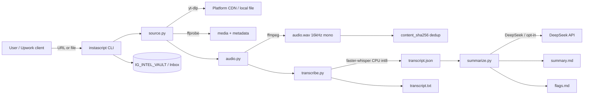
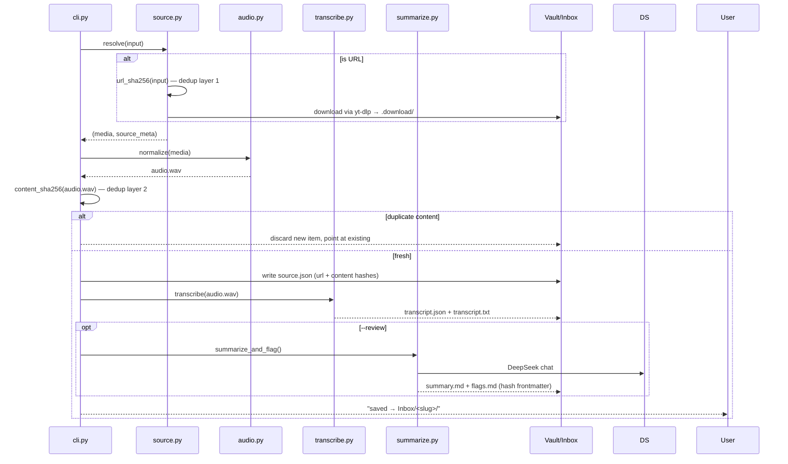
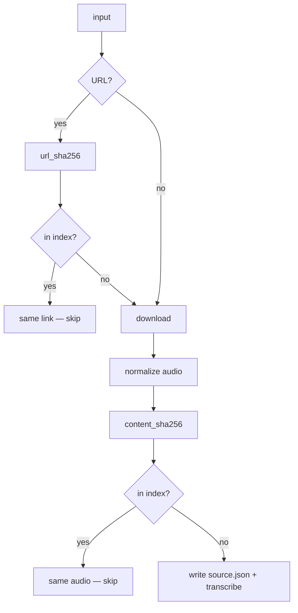

# instaScript — Architecture

**A single, deterministic, local-first pipeline.** Input is a URL or an audio /
video file; output is a verbatim, timestamped transcript plus (optionally) an
AI-written summary and factual-flag list. No agent orchestrates the pipeline at
runtime — the CLI drives it directly. Everything is standalone.

```
┌─────────────────────────── Components ───────────────────────────┐
│                                                                   │
│  instascript                                                    │
│   ├── cli.py          orchestration, dedup, exit codes            │
│   ├── source.py       stage A: resolve URL/file → media+metadata  │
│   ├── audio.py        stage B: normalize → 16 kHz mono wav        │
│   ├── transcribe.py   stage C: faster-whisper → transcript JSON   │
│   ├── summarize.py    stage D (opt): DeepSeek → summary + flags   │
│   ├── llm.py          provider seam (DeepSeek now, OpenRouter…    │
│   │                                 reserved for RAG)             │
│   ├── config.py       env-driven configuration, no hardcoding     │
│   └── ui.py           terminal rendering (human/scriptable)       │
│                                                                   │
│  External tools        yt-dlp · ffmpeg · ffprobe · faster-whisper │
│  External service      DeepSeek chat API (--review only, opt-in)  │
└───────────────────────────────────────────────────────────────────┘
```

## System context (UML)



## Single-ingest sequence



## Module responsibilities

| module | responsibility | depends on |
|---|---|---|
| `cli.py` | arg parsing, mode dispatch, dedup, queue mutation, exit codes | all stages |
| `source.py` | URL normalization + hashing, yt-dlp download, ffprobe metadata, local-file resolution | yt-dlp, ffprobe |
| `audio.py` | ffmpeg normalization to 16 kHz / mono / s16 PCM | ffmpeg |
| `transcribe.py` | faster-whisper (int8, CPU) with VAD + word timestamps; writes canonical transcript | faster-whisper |
| `summarize.py` | DeepSeek summary + factual flags; YAML frontmatter tracing hashes | llm.py |
| `llm.py` | provider abstraction (`LLMProvider`) — swap without touching stages | requests |
| `config.py` | all knobs via env; neutral defaults | — |
| `ui.py` | colored progress/summary rendering; auto-disables off-TTY | — |

## Data model

### `source.json` — provenance + dedup keys

```json
{
  "input": "https://www.instagram.com/reel/DY-iZeGgYjj/?utm_source=...&igsh=...",
  "kind": "url",
  "url_sha256": "f7787afc…f65e",
  "slug": "video-by-justxashton",
  "title": "Video by justxashton",
  "source_id": "DY-iZeGgYjj",
  "uploader": "Ashton Forbes",
  "duration": 28.587,
  "downloaded_at": "2026-08-05T12:10:27Z",
  "orig_format": "m4a",
  "content_sha256": "d34d499b…4829"
}
```

- `url_sha256` — SHA-256 of the link with share-tracking params (`utm_*`,
  `igsh`, `fbclid`, …) stripped. Same share link, different utm string → same
  hash → dedup without downloading.
- `content_sha256` — SHA-256 of the normalized audio's **PCM samples** (the
  WAV header is skipped — it can vary between ffmpeg builds while the audio is
  identical). Decoding is deterministic, so the same reel from a different URL
  or in another format still hashes identically, even across encoders.

### `transcript.json` — canonical ground truth

```json
{
  "model": "small",
  "language": "en",
  "duration": 28.59,
  "audio_file": "audio.wav",
  "segments": [
    {
      "id": 0,
      "start": 0.0,
      "end": 6.06,
      "text": "We can convert normal electromagnetic waves into gravitational waves.",
      "words": [{ "word": "We", "start": 0.0, "end": 0.18 }]
    }
  ]
}
```

Word-level timestamps feed downstream search, captioning, or RAG. Written once,
never rewritten (ground-truth invariant).

## Dedup decision flow



The index is rebuilt by scanning every `source.json` under the vault and the
output root — no central DB, plain files, trivially portable.

## Failure modes & exit codes

| exit | meaning | handling |
|---|---|---|
| `0` | success (new transcript, or deduped) | queue line deleted |
| `1` | item failed (resolve/download/ffmpeg error) | queue line kept for retry; error shown |
| `2` | usage error (no input, unknown mode) | help message |

- **Review failure** (missing `DEEPSEEK_API_KEY`, API error): warns, keeps the
  transcript, exits `0` — review is additive, never a blocker. Re-run later with
  `instascript --review-item <slug>`.
- **Instagram / logged-in platforms**: yt-dlp retries with browser cookies
  (`YTDLP_COOKIES_FROM_BROWSER`, comma-separated retry order). Offline sources
  (YouTube, TikTok, podcast feeds) work anonymously.

## Resolved failure cases

Bugs found during hardening, fixed, and regression-tested:

| failure | root cause | fix |
|---|---|---|
| Instagram "empty media response" on every URL ingest | Instagram requires a logged-in session | yt-dlp auto-retries with browser cookies (`YTDLP_COOKIES_FROM_BROWSER`, comma-separated) only when an auth wall is detected — offline platforms stay cookie-free |
| URL ingest saved a file literally named `filepath` | yt-dlp `--print` template used the bare `filepath` token instead of `%(filepath)s` | corrected template; verified against a live download |
| `content_sha256` differed between two ffmpeg builds for byte-identical audio | the RIFF/WAV **header** carries build-specific metadata; whole-file hashing picked it up | hash only the PCM samples (stdlib `wave`), so the hash is header-stable and machine-independent |
| NixOS pip wheels crash with `libstdc++.so.6: cannot open shared object file` | pip wheels link glibc-family libs absent from the loader path | `bin/instascript` detects NixOS and exports the nix lib paths; the nix package links them natively |
| queue printed `[0/N]` for the first item | used the file line index instead of the item position | enumerate the pending list, not the source file lines |

## Security & privacy boundary

- Transcription is **fully local** — audio never leaves the machine.
- The only network egress, by design: (a) downloading the source media via
  yt-dlp, (b) the **opt-in** DeepSeek call in `--review`. No telemetry, no
  analytics, no phone-home.
- Dedup hashes are non-reversible SHA-256 — safe to store in markdown
  frontmatter and source metadata.

## Runtime requirements

| tool | purpose | required for |
|---|---|---|
| Python ≥ 3.10 | runtime | all |
| ffmpeg + ffprobe | normalization + probing | all |
| yt-dlp | URL download | URLs only |
| faster-whisper | transcription (CPU int8) | all |
| DeepSeek API key | summary + flags | `--review` / `--review-item` only |
| browser login | Instagram and other walled platforms | those platforms only |
